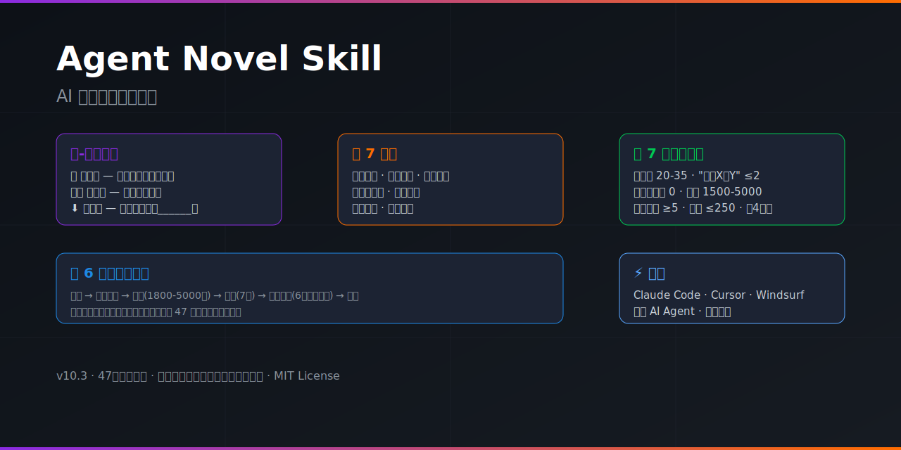

<p align="center">
  
  
  
  
  
</p>

<p align="center">
  
</p>

---

## 🎯 为什么你需要这个

AI 写小说最大的问题——**一眼就能看出是 AI 写的**。

```
❌ "仿佛""似乎""或许"满天飞
❌ 角色只会"沉默+动作细节"万能公式
❌ 章节有开头有结尾，中间角色没变过
❌ 战斗像在"报告"而不是"经历"
❌ 每章读起来都一样——同一个公式套了 50 次
```

**这个 Skill 就是来干掉这些的。**

---

## 🔥 核心创新：核-心写作法

> **不写没有"核"的场景。** 核 = 角色在这一场的内心变化。

每一章、每一场，先问：角色从 X 到了 Y 吗？

### 三种核型

| 核型 | 含义 | 一句话判断 |
|------|------|-----------|
| 🔄 **变化型** | 角色在这一场改变了 | "他变了" |
| ❌🔄 **失败型** | 想改变但没改成 | "他试了，没做到"——比成功更推动剧情 |
| ⬇️ **深化型** | 选择不改变，用新细节强化已有特质 | "他还是他——但更______了" |

> **为什么这很重要？** 大多数 AI 写作只有"深化型"——角色从头到尾一个样，只是"更"了。真正推动读者翻页的是"变化型"和"失败型"。

---

## 🗡️ 7 把刀（金手指手法体系）

每章情感爆点处组合使用：

| # | 刀 | 效果 |
|---|------|------|
| ① | **通感置换** | 声音变成颜色、触觉变成气味 |
| ② | **环境反射** | 用环境天气映射内心 |
| ③ | **视角滑轨** | 贴着角色→拉开距离→再贴回去 |
| ④ | **物的时间线** | 一个物品贯穿多个时间点 |
| ⑤ | **压缩时间** | 关键瞬间放慢，日常用一句话跳过 |
| ⑥ | **意外回应** | 角色不做读者期待的事 |
| ⑦ | **全景收束** | 章末一个镜头收住全章 |

+ **5 种比喻手法** · **感官变形** · **分镜头规范** · **NPC 死亡铁律**

---

## ✅ 7 条硬性质检（自动化脚本）

一键扫描，逐条 PASS/FAIL：

```
① 破折号 ——              20-35 次/章
② "不是X是Y"句式          ≤2 次/章
③ 抽象情绪词（感到/觉得/知道/认为/明白）  0 次（叙述中）
④ 正文字数                1500-5000 字
⑤ 单行段落                ≥5 个
⑥ 最长段落                ≤250 字
⑦ 连续逗号不换句          禁止连续 4 个逗号
```

附带 `quality-check.sh`，2 秒出结果。

---

## 📦 6 步硬性流水线

每一步都不能跳过，每一步都有产出：

```
┌─────────┐   ┌─────────┐   ┌─────────┐   ┌──────┐   ┌─────────┐   ┌──────┐
│ ① 准备   │→ │ ② 核型  │→ │ ③ 写作  │→ │ ④ 质检│→ │ ⑤ 文件  │→ │ ⑥ 核验│
│ 前章记忆 │   │ 设计    │   │ 正文    │   │ 7项  │   │ 更新    │   │ 复查  │
│ 加载    │   │ 节拍排布│   │ 1800-   │   │ 扫描  │   │ 6个追踪 │   │      │
│         │   │ 手法预选│   │ 5000字  │   │      │   │ 文件    │   │      │
└─────────┘   └─────────┘   └─────────┘   └──────┘   └─────────┘   └──────┘
```

---

## 🚀 Bootstrap：4 问启动新小说

```
① 标题 / ② 类型 / ③ 一句话前提 / ④ 主角
→ 自动生成：目录 + MASTER_SETTING + 8 个追踪文件
```

---

## 📁 文件结构

```
agent-novel/
├── SKILL.md                    # 主技能文件（完整写作框架）
├── quality-check.sh            # 7 条质检规则自动化脚本
├── poster.svg                  # 项目海报
├── references/                 # 12 个参考文件
│   ├── nucleus-first-method.md       # 核-心写作法完整说明
│   ├── seven-knives.md               # 7 把刀写作技法
│   ├── golden-finger-techniques.md   # 金手指手法体系
│   ├── nucleus-to-technique-index.md # 核型→技法快速查表
│   ├── writing-techniques.md         # 通用写作技法库
│   ├── writing-rules.md              # 各类型写作规则
│   ├── qc-rules.md                   # 质检规则详解
│   ├── hook-types.md                 # 5 型钩子分类
│   ├── narrator-modes.md             # 叙述模式指南
│   ├── pleasure-points.md            # 爽点分布设计
│   ├── rhythm-models.md              # 节奏模型
│   ├── genre-guide.md                # 各类型禁用词指南
│   └── novel-doctor-checklist.md     # 小说诊断清单
└── templates/
    ├── MASTER_SETTING.template.md
    └── project-files.template.md
```

---

## 🎬 适用场景

`番茄小说` `起点` `晋江` · 免费阅读平台高完读率写作 · 长篇连载（50-100 章） · 所有类型：都市 / 奇幻 / 末世 / 古风 / 科幻 / 悬疑 / 言情 / 轻小说

---

## 📊 实战验证

在真实小说项目《废墟上的炊烟与少年》中验证 **47 章**：
- 每章质检 7/7 PASS ✅
- AI 腔禁用词 0 违规 ✅
- 8 角色弧线逐章追踪 ✅
- 接缝笔记 47 章连续性 0 断裂 ✅

---

## ⚡ 使用方式

放入 `~/.claude/skills/agent-novel/`，Claude Code 自动识别。

**触发关键词：** `写第X章` · `写下一章` · `续写小说` · `开始新小说` · `诊断小说`

---

<p align="center">
  <sub>v10.3 — 核-心写作法：三种核型(🔄变化/❌🔄失败/⬇️深化) + 防退步三机制 + 感情线核-心化</sub>
  <br>
  <sub>Built with ❤️ for writers who refuse to sound like AI</sub>
</p>
